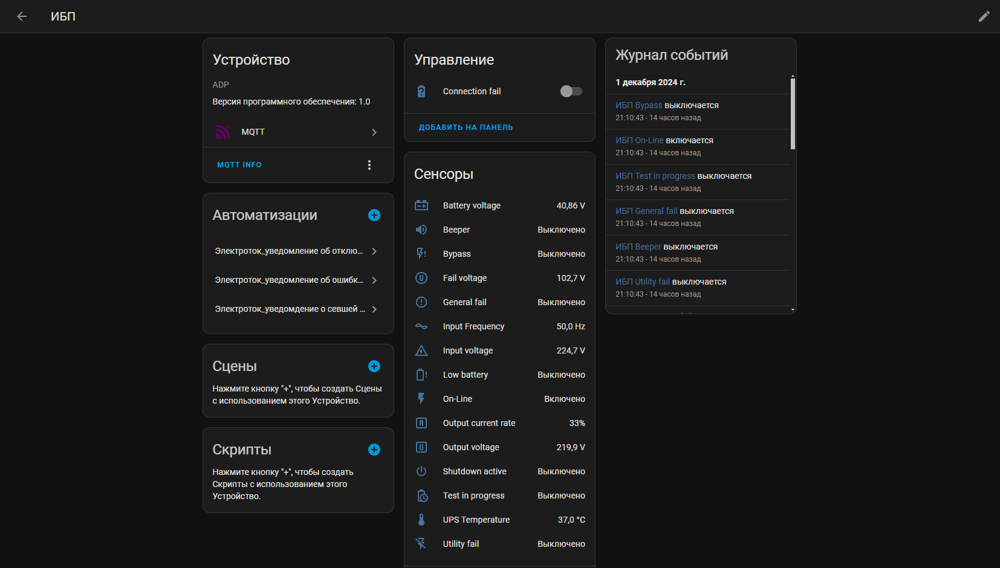
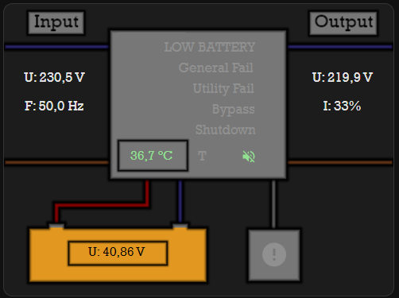
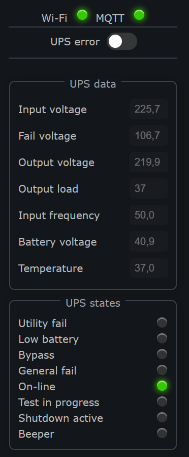
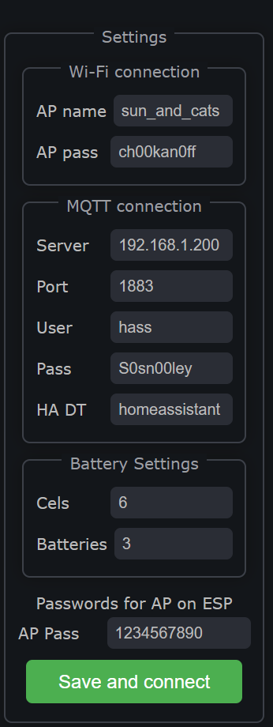

# Монитор ИБП с протоколом Megatec для HomeAssistant
Устройство на базе контроллера ESP8266 для получения данных по RS232 от источника бесперебойного питания (ИБП) и передачи их в HomeAssistant.

## Схема
Схема сборки на рисунке ниже. Исходник схемы, если надо /files/UPS_Control.fzz

**Важно!** Если не заработало после сборки, то можно попробовать менять местами RX-TX. Их тут две пары: от контроллера к преобразователю и от преобразователя к плате ИБП. То, как указано на схеме работает в моем случае.

Вместо Wenmos вполне можно использовать другие контроллеры, но тестировалось только на нём. В качестве преобразователя нужен MAX3232, так как он работает от 3.3V. MAX232 судя по всему только от 5 вольт.

## Прошивка
Разрабатывал и прошивал в ArduinoIDE. Файл прошивки /src/UPS_Connector.ino. Для сборки прошики нужны некоторые библиотеки, ссылки на них указаны в комментариях в самом коде прошивки. Все устанавливаются через менеджер библиотек ArduinoIDE. Для работы ESPSoftwareSerial нужна последняя версия платы, поэтому перед сборкой лучше обновить платы.

Настройки прошивки можно не трогать, если паять по схеме. Либо поменять пины для ESPSoftwareSerial, если используете другие пины. 

Перед прошивкой желательно затереть Flash память, так как используется сохранение настроек в память и при наличии там мусора могут быть проблемы. На новых модулях этого можно не делать, должно работать и так.

Для wemos выложен также готовый бинарник, можно прошить его, если ничего не планируете менять в самой прошивке. Файл в /bin/UPS_connector.ino.d1_mini.bin

## Возможности
### Сбор данных с ИБП
Реализован опрос ИБП по протоколу Megatec, сделано получение следующих данных:
- InputVoltage. Входное напряжение
- FailVoltage. Напряжение ошибки
- OutputVoltage. Выходное напряжение
- Output load. Загрузка ИБП по току в процентах от максимальной загрузки.
- InputFrequency. Частота тока. По протоколу написано, что это для входной линии, судя по тестам - для выходной. Однако, оставлено так, потому что не смог понять, это особенность моего тестового ИБП или всё-таки стандарт.
- BatteryVoltage. Напряжение батареи. Для On-line ИБП выдает напряжение на одной банке. Для корректного отображения в HA на портале есть множители. Смотри ниже в описании портала.
- Tempetature. Температура ИБП.
- UtilityFail. Флаг ошибки, когда возникают проблемы с вводной сетью.
- LowBattery. Флаг ошибки при низком заряде батареи.
- Bypass. Сигнал включенного байпаса.
- GeneralFail. Что-то типа общей ошибки в работе ИБП.
- OnLine. Тип ИБП. Если включено, значит On-line.
- TestInProgress. Флаг запущенного теста батарей.
- ShutDownActive. Флаг того, что запущен процесс выключения ИБП.
- Beeper. Состояние звукового сигнала.

И отдельно сделан параметр потери связи с ИБП ConnectionFail. Возводится если контроллер не может долго получить данные от ИБП. В таком случае он будет пытаться восстановить связь раз в 5 минут автоматически.

### Передача данных в HA
Подключение через службу MQTT с AutoDyscovery. Чтобы устранить возможные конфликты - сделана автоматическая генерация GUID при первом старта устройства или при затирании flash.
Само устройство после добавления выглядит так:

Сделана дополнительная карточка для большей наглядности. При создании карточки использовались стандартная карточка picture-elements, [custom:button-card](https://github.com/custom-cards/button-card) и [cardmod](https://github.com/thomasloven/lovelace-card-mod).
Вид карточки показан на скриншоте снизу. Исходник картинки подложки (GIMP) лежит тут: files/HAUPSCardBackground.xcf. Сама картинка подложка тут: HA_Card/HAUPSCardBackground.xcf. YAML карточки тут: HA_Card/HA_card.yaml. В карточке надо будет указать корректные наименования объектов, так как они будут сохранены в HA.

ConnectionFail в HA сделан выключателем. И его можно выключить, тогда контроллер попытается восстановить связь с ИБП. При включении этого выключателя, связь с ИБП не будет прерываться и состояние выключателя вернется в выключенное состояние.

При потере питания, отвала сети и т.д. устройство в HA помечается недоступным спустя минуту (примерно).

### Портал на устройстве и настройки
Реализован портал, для настройки подключения и получения данных с устройства без HA. После первого включения устройства, создается точка доступа UPSControl с паролем 1234567890 (можно поменять в настройках). После подключения к ней надо перейти по адресу 192.168.1.1. Откроется окно портала. Там нужно ввести реквизиты доступа к Wi-Fi и подключения к MQTT серверу, к которому подключен HA. Топик для дискавери по умолчанию установлен стандартный homeassistant, если необходимо, то можно его поменять. После нажатия Save and Connect контроллер пытается подключиться к сети и MQTT серверу. Если коннект успешен, то контроллер начинает отправлять данные в HA. На портал в таком случае можно зайти, перейдя в браузере по IP, который выделил для контроллера роутер.

Сделано автоматическое восстановление связи с Wi-Fi и MQTT. Если коннект пропал, то контроллер поднимает точку доступа UPSControl, как при первом старте. И пытается раз 3 минуты подключиться заново.

Помимо настроек сети на портале доступно:
- Просмотр всех параметров, полученных от ИБП. Обновляются онлайн.
- Выключение ConnectionFail по аналогии с таким выключателем в HA (смотри выше).
- Настройка батарей. Можно указать сколько ячеек в одной батарее и сколько последовательно соединено батарей в сборке. На основе этой информации контроллер считает вольтаж всей баратеи и именно эту цифру передает в HA и на портал.
- OTA обновления прошивки по воздуху. Доступно через отдельную страницу 192.168.1.1/ota_update, либо надо указать IP адрес от роутера вместо "192.168.1.1".

Скриншоты портала ниже:

## Поддерживаемые ИБП
По идее должны поддерживаться любые ИБП с протоколом Megatec и выходом RS232. Однако тестировалось только на [Штиль SW1000L](https://www.shtyl.ru/catalog/ibp/odnofaznye/nastennye/sw1000l-1000-va-900-vt/) с картой расширения [IC-RS232/Dry contacts](https://www.shtyl.ru/catalog/ibp/aksessuary/karty-monitoringa/ic-rs-232-dry-contacts/)

## TODO
В будущем планируется сделать отправку дополнительных команд на ИБП:
- Включение/отключение звука
- Запуск/остановка тестов
